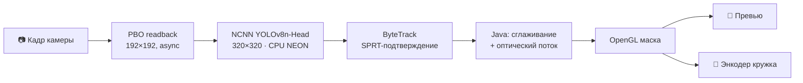

<div align="center">

# 🫥 Blur Faces

**Автоматическое скрытие лиц в кружках exteraGram — в реальном времени, полностью офлайн.**


<br>


[Возможности](#-возможности) · [Как это работает](#-как-это-работает) · [Установка](#-установка) · [Настройки](#%EF%B8%8F-настройки) · [Приватность](#-приватность-и-ограничения) · [Разработка](#%EF%B8%8F-разработка)

</div>

---

## ✨ Возможности

| | |
|---|---|
| 🎯 **Нейросетевой детектор** | YOLOv8n-Head находит головы в фас, в профиль и со спины |
| 🔒 **Fail-closed** | При старте, смене камеры или ошибке кадр закрывается целиком: лучше лишнее размытие, чем открытое лицо |
| 📡 **Ноль сети** | Модель, нативная библиотека и DEX лежат внутри `.elyx`, плагин ничего не скачивает даже при первом запуске |
| 🎬 **Превью и запись** | Маска накладывается на превью камеры **и** на кадры энкодера, то есть на то, что реально уйдёт собеседнику |
| 🎨 **Три стиля** | Гауссово размытие, пикселизация или сплошная маска |
| 🌙 **Темнота** | CLAHE по яркости и адаптивные пороги, чтобы не терять лица при плохом свете |
| 🔘 **Кнопка в камере** | Защиту можно быстро выключить и включить прямо в интерфейсе кружка |

## 🧠 Как это работает



1. **Захват.** Кадр асинхронно читается через двойной буфер OpenGL PBO, поэтому GL-поток камеры не блокируется.
2. **Детекция.** YOLOv8n-Head на Tencent NCNN, два потока CPU с ARM64 NEON.
3. **Трекинг.** Нативный ByteTrack накапливает уверенность по нескольким кадрам (тест Вальда, SPRT), отсекает случайные срабатывания на предметах и удерживает трек при коротких пропусках.
4. **Рендер.** Java сглаживает геометрию и учитывает движение, шейдер накладывает маску на превью и на кадры энкодера.

> [!NOTE]
> На устройстве (SM8750) один инференс занимает 50–120 мс, это примерно 7–8 кадров детектора в секунду. Между ними маску ведут трекер и оптический поток.

## 📦 Установка

1. Скачайте или соберите `blur_faces-1.0.0.elyx` (см. [Разработка](#%EF%B8%8F-разработка)).
2. Откройте файл в exteraGram и включите плагин.
3. **Перезапустите приложение** после обновления: подменить уже загруженный native runtime без перезапуска нельзя.

**Требования:** Android arm64-v8a, exteraGram ≥ 12.5.1, SDK ≥ 1.4.4.3.

> [!WARNING]
> Плагин использует внутренние хуки камеры и энкодера. Совместимость конкретной сборки клиента нужно проверить на устройстве. Если плагин не загрузился, камеру **нельзя** считать защищённой.

## ⚙️ Настройки

| Параметр | Варианты | Смысл |
|---|---|---|
| **Размытие по умолчанию** | вкл / выкл | Включать ли защиту при открытии камеры |
| **Стиль защиты** | Размытие · Пикселизация · Сплошная маска | Как выглядит закрытое лицо |
| **Чувствительность** | Обычная · Повышенная · Высокая (35 / 25 / 18%) | Чем выше, тем больше принимается менее различимых лиц |
| **Debug-кадры** | 5 минут | Локальная запись кадров для разбора ошибок, см. ниже |

> [!TIP]
> Если сомневаетесь, ставьте чувствительность выше. Лишнее размытие ничему не вредит, а пропущенное лицо уже не спрятать.

## 🛡 Приватность и ограничения

- **Никакой сети.** DEX, ARM64 ELF, `head_det.param` и `head_det.bin` входят в `.elyx`. Загрузчик проверяет SHA-256 и копирует ресурсы в закрытый каталог приложения.
- **Сбой — это не «пустая сцена».** Ошибка инференса, некорректная геометрия или больше четырёх голов в кадре включают полнокадровую защиту до следующего успешного результата.
- **Смена камеры** сбрасывает очередь и треки, поздние результаты от старой камеры отбрасываются.
- **Чистые кадры не сохраняются**, пока debug-захват не включён вручную.

> [!CAUTION]
> Это **не гарантия анонимности**. Модель может пропустить голову, а человека можно узнать и по другим признакам. Подтверждённых замеров «30–60 FPS» или «ноль ложных срабатываний» для текущей сборки нет. Копии ресурсов могут остаться в закрытых каталогах приложения после удаления плагина.

<details>
<summary><b>🐞 Локальный debug-захват</b></summary>

<br>

Включайте «Сохранять debug-кадры · 5 минут» **только с согласия людей в кадре**: сохраняются неразмытые кадры. Потом воспроизведите ложное срабатывание или пропуск. Кнопка «Обновить статус и показать путь» покажет состояние, число и объём архивов и каталог `no_backup/blur_faces_debug`. Плагин ничего не отправляет, ZIP можно забрать только локально (root/SSH).

- До 2 образцов в секунду, один фоновый writer. Лимит 300 ZIP или 32 МиБ может остановить запись раньше пяти минут.
- Запись выключается через 5 минут, при выгрузке плагина и перезапуске приложения. **Файлы при этом остаются.** Кнопка удаления останавливает запись и стирает файлы, записи старше суток чистятся при следующем запуске.
- В каждом ZIP: `frame.rgba` (192×192 RGBA8888 до CLAHE), `candidate_*.jpg` и `track_*.jpg` с контекстом 25% и `metadata.json`.
- `metadata.json` содержит хеш бандла, источник камеры, временные метки, пороги и яркость, кандидатов после фильтров и NMS, нативные треки (`frames_lost`) и Java-геометрию.

**Как читать:** если кандидат стоит на постороннем объекте, ошибается детектор. Если кандидата нет, а есть `predicted_track`, это нативный coasting. Если нативных треков нет, а есть `java_tracks`, это удержание на стороне Java.

Модель выдаёт рамки, а не маски сегментации, и это не снимок финального шейдера: итоговое видео проверяется отдельно.

</details>

## 🛠️ Разработка

<details open>
<summary><b>Сборка</b></summary>

<br>

Нужны JDK 17+, Android SDK/NDK, локальные бинарники NCNN, `elyb` и оба файла модели в `models/`.

```bash
./build.sh
```

Скрипт принимает `JAVA_HOME`, `ANDROID_NDK_ROOT` и `ELYX_BUILDER`. Результат будет в `builds/`. Веса (~5,8 МиБ до сжатия) уже внутри архива.

</details>

<details>
<summary><b>Тесты</b></summary>

<br>

```bash
JAVA_HOME=/usr/lib/jvm/java-17-openjdk-amd64 ./gradlew testReleaseUnitTest
PYTHONDONTWRITEBYTECODE=1 python3 -m pytest -p no:cacheprovider tests/tests_*.py
python3 tests/tests_tracking_behavior.py
python3 tests/tests_elyx_contract.py
```

| Тест | Что проверяет |
|---|---|
| JUnit | Java-трекинг, обработку ошибок, оптический поток, debug-хранилище (Android API здесь заглушки) |
| `tests_native_behavior.py` | Настоящий C++ ByteTrack и JNI-политику под UBSan, нужен `g++`. Без NCNN-инференса |
| `tests_runtime_behavior.py` | Загрузчик: офлайн-копирование, хеши, восстановление кэша, отказ на битой модели |
| `tests_elyx_contract.py` | Zero-network и соответствие Python, DEX, ELF и модели содержимому `.elyx` |
| `scripts/test_debug_device.py --host phone` | ES3/PBO, JPEG/ZIP и NCNN/JNI на реальном телефоне на синтетических кадрах |
| `tests_tracking_behavior.py` | Упрощённая математическая модель трекинга, не заменяет production-тесты |

</details>

<details>
<summary><b>Структура</b></summary>

<br>

```text
src/
├── head_detector.cpp   # NCNN-инференс, CLAHE, геометрические фильтры
├── bytetrack.cpp       # ByteTrack + SPRT-подтверждение
├── main.cpp            # JNI
└── main/java/…/g2/
    ├── Main.java          # хуки камеры и энкодера, шейдеры
    ├── CleanFrameTap.java # PBO readback, blur
    └── NativeBridge.java  # JNI-мост
BlurFaces/              # содержимое плагина: UI, runtime, строки, ассеты
tests/                  # тесты и контракты
```

Архитектура и инварианты описаны в [`AGENTS.md`](AGENTS.md).

</details>

> [!IMPORTANT]
> Перед релизом обязательна [проверка на телефоне](DEVICE_VALIDATION.md), включая покадровый просмотр **записанного** кружка. Одного превью недостаточно.

---

<div align="center">

Автор: [@gemeguardian](https://t.me/gemeguardian) · сделано для exteraGram

</div>
