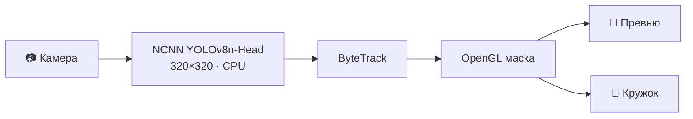

<div align="center">

# 🫥 Blur Faces

**Размывает лица в кружках exteraGram в реальном времени. Работает офлайн.**


<br>


</div>

## ✨ Возможности

- 🎯 **Головы в любом ракурсе:** в фас, в профиль и со спины (YOLOv8n-Head)
- 🎬 **Превью и запись:** маска попадает в само видео, которое получит собеседник
- 🔒 **Fail-closed:** при старте, смене камеры или ошибке закрывается весь кадр
- 📡 **Без сети:** модель и библиотеки лежат внутри `.elyx`
- 🎨 **Три стиля:** размытие, пикселизация, сплошная маска
- 🔘 **Кнопка в камере:** защита включается и выключается прямо в кружке

## 📦 Установка

1. Откройте `blur_faces-1.0.0.elyx` в exteraGram и включите плагин.
2. После обновления **перезапустите приложение**.

Нужны Android arm64-v8a и exteraGram ≥ 12.5.1.

## ⚙️ Настройки

| Параметр | Варианты |
|---|---|
| Размытие по умолчанию | вкл / выкл |
| Стиль защиты | размытие · пикселизация · сплошная маска |
| Чувствительность | обычная · повышенная · высокая |

> [!TIP]
> Если сомневаетесь, ставьте чувствительность выше: лишнее размытие не вредит, а пропущенное лицо уже не скрыть.

## 🧠 Как это работает



Кадры читаются асинхронно, без задержки камеры. Трекер подтверждает голову по нескольким кадрам и отсекает случайные срабатывания на предметах. На SM8750 детектор выдаёт 7–8 кадров в секунду, в промежутках маску ведёт трекер.

> [!CAUTION]
> Это не гарантия анонимности: модель может пропустить голову. Если плагин не загрузился, камера **не** защищена.

## 🛠️ Сборка

```bash
./build.sh   # JDK 17+, Android NDK, elyb → builds/blur_faces-1.0.0.elyx
```

<details>
<summary>Тесты</summary>

```bash
./gradlew testReleaseUnitTest
python3 -m pytest tests/tests_*.py
python3 tests/tests_elyx_contract.py
python3 scripts/test_debug_device.py --host phone   # на телефоне
```

Архитектура и инварианты описаны в [`AGENTS.md`](AGENTS.md), чек-лист перед релизом в [`DEVICE_VALIDATION.md`](DEVICE_VALIDATION.md).

</details>

<details>
<summary>Debug-захват</summary>

В настройках есть «Сохранять debug-кадры · 5 минут». Он пишет **неразмытые** кадры в `no_backup/blur_faces_debug`, поэтому включайте его только с согласия людей в кадре. Файлы никуда не отправляются, их можно забрать через root или SSH и удалить кнопкой в настройках.

</details>

## 🙏 Благодарности

Модель: [abhiWanKenobi/yolov8n_head_detection](https://huggingface.co/abhiWanKenobi/yolov8n_head_detection), обучена на HollywoodHeads (Vu et al., ICCV 2015).

| | Лицензия |
|---|---|
| Веса модели | [CC BY-NC 4.0](https://creativecommons.org/licenses/by-nc/4.0/), только некоммерческое использование |
| [Ultralytics YOLOv8](https://github.com/ultralytics/ultralytics) | AGPL-3.0 |
| [Tencent NCNN](https://github.com/Tencent/ncnn) | BSD-3-Clause |

<div align="center">

<sub>by [@gemeguardian](https://t.me/gemeguardian)</sub>

</div>
